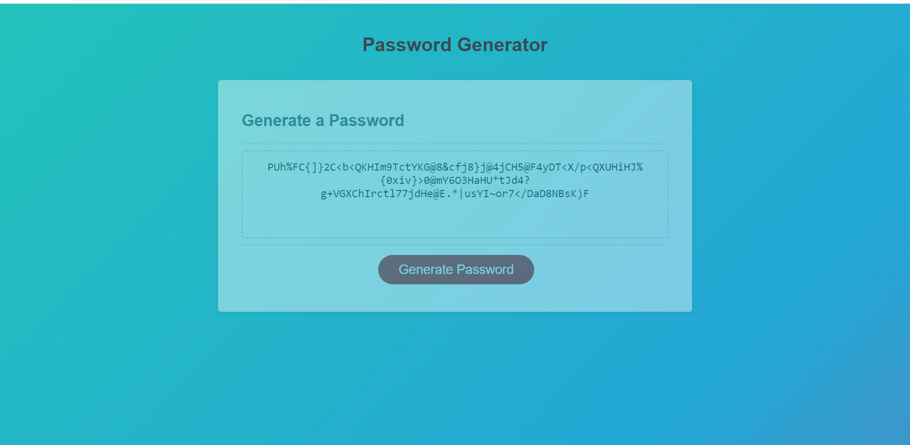

# Password Generator

# Purpose
A website that can generate random password and user still can choose what criteria to include in the password such as special characters.

# Screenshot of Password Generator 

# User Story
AS AN employee with access to sensitive data
I WANT to randomly generate a password that meets certain criteria
SO THAT I can create a strong password that provides greater security

# Website
https://lernantino.github.io/run-buddy/

# Build with 
* HTML
* CSS
* JavaScript 
# Author
Halima Ikbal

# 🤝 Support 
Contributions, issues, and feature requests are welcome!

